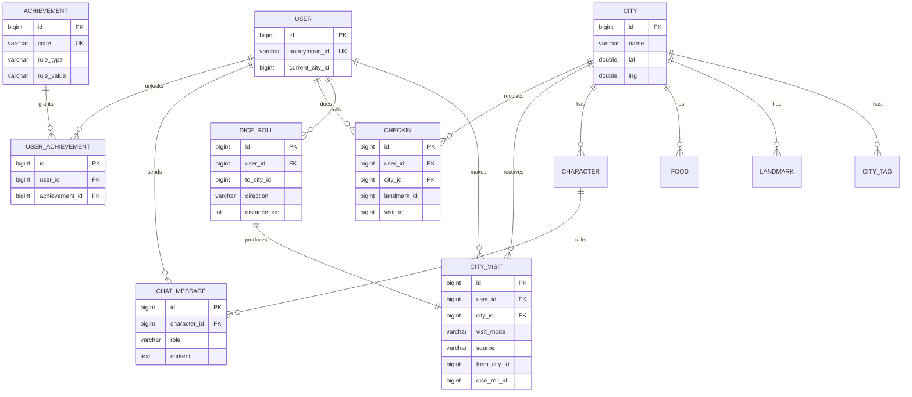

# 数据模型与 ER 图（data-model-er.md）

> 对应概要设计 14 章。逐字段见 database-detailed-design.md。

## 1. 核心实体（12 个）
User、City、CityTag、Landmark、Food、Character、CityVisit、DiceRoll、Checkin、Achievement、UserAchievement、ChatMessage。

## 2. 关键抽象：CityVisit（城市访问）
自由探索与游戏互动**不是两套系统**，而是两种「到达城市」的方式。两者最终都写入 CityVisit，用 `visit_mode`(free/game) 区分来源。到达后共享：城市详情 → AI 对话 → 赛博打卡 → 成就。这是降低双模式开发成本的核心设计。

## 3. 实体关系
```text
User 1 ── N CityVisit
User 1 ── N DiceRoll
User 1 ── N Checkin
User 1 ── N ChatMessage
User 1 ── N UserAchievement

City 1 ── N CityTag
City 1 ── N Landmark
City 1 ── N Food
City 1 ── N Character
City 1 ── N CityVisit
City 1 ── N Checkin

DiceRoll 1 ── 1 CityVisit   (city_visits.dice_roll_id 回指)
Character 1 ── N ChatMessage
Achievement 1 ── N UserAchievement
```

## 4. Mermaid ER 图


## 5. 读写热点（指导索引）
| 场景 | 主要查询 | 建议索引 |
|---|---|---|
| 成就判定 | 按 user 聚合 checkins / city_visits | checkins(user_id,created_at)、city_visits(user_id,city_id) |
| 成就墙 | user_achievements 按 user | user_achievements UNIQUE(user_id,achievement_id) |
| 对话历史 | 按 user+character 拉取 | chat_messages(user_id,character_id,created_at) |
| 城市详情 | 按 city 取 landmark/food/character | 各表 INDEX(city_id) |

## 6. 数据生命周期
- 用户：匿名创建，长期保留（localStorage 关联）。
- 内容（city/landmark/food/character/achievement）：seed 导入，演示期只读。
- 行为（visit/dice/checkin/chat/user_achievement）：运行时产生，可累积。