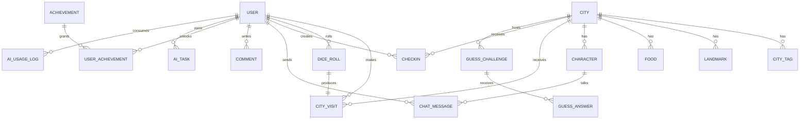

# 数据模型与 ER 图

## 1. 核心实体

当前 GORM 模型覆盖 17 张表：

```text
users
cities / city_tags / landmarks / foods / characters
city_visits / dice_rolls / checkins
achievements / user_achievements
chat_messages / comments
ai_tasks / ai_usage_logs
guess_challenges / guess_answers
```

字段级设计见 `../design/database-detailed-design.md`。

## 2. 关键抽象

| 抽象 | 说明 |
|---|---|
| CityVisit | 用户到达城市的事实，统一承接自由探索与任意门随机漫游。 |
| DiceRoll | 任意门随机方向、距离、目标点与目标城市记录。 |
| Checkin | 用户确认打卡后的资产与成就数据来源。 |
| Achievement | 配置化规则定义，后台可维护。 |
| AITask | 异步图像生成任务，避免请求阻塞。 |
| GuessChallenge | 匿名分享挑战，不暴露创建者 user_id。 |

## 3. 实体关系

```text
User 1 - N CityVisit
User 1 - N DiceRoll
User 1 - N Checkin
User 1 - N ChatMessage
User 1 - N Comment
User 1 - N UserAchievement
User 1 - N AITask
User 1 - N AIUsageLog

City 1 - N CityTag
City 1 - N Landmark
City 1 - N Food
City 1 - N Character
City 1 - N CityVisit
City 1 - N Checkin
City 1 - N GuessChallenge

DiceRoll 1 - 1 CityVisit
Character 1 - N ChatMessage
Achievement 1 - N UserAchievement
GuessChallenge 1 - N GuessAnswer
```

## 4. Mermaid ER 图



## 5. 读写热点

| 场景 | 主要索引 |
|---|---|
| 城市列表 | `cities.name`、`city_tags(city_id, tag)` |
| 城市详情 | `landmarks(city_id)`、`foods(city_id)`、`characters(city_id)` |
| 足迹资产 | `city_visits(user_id, created_at)`、`checkins(user_id, created_at)` |
| 成就判定 | `checkins(user_id, city_id)`、`city_visits(user_id, city_id)`、`dice_rolls(user_id, created_at)` |
| 对话历史 | `chat_messages(user_id, character_id, created_at)` |
| 生图 worker | `ai_tasks(status, updated_at)`、`ai_tasks(type, status)` |
| AI 用量 | `ai_usage_logs(user_id, usage_type, usage_date)` |
| 猜城市挑战 | `guess_challenges(code)`、`guess_answers(challenge_code, created_at)` |

## 6. 数据生命周期

- 内容数据：数据库为事实源，后台 CMS 维护；seed 用于初始化和受控同步。
- 用户数据：匿名身份保存在前端持久化 store，可升级为账号。
- 行为数据：访问、掷骰、对话、评论、打卡、成就、挑战持续累积。
- 运行时文件：`uploads/` 中的用户上传、生成图和后台导入图不提交到仓库。
